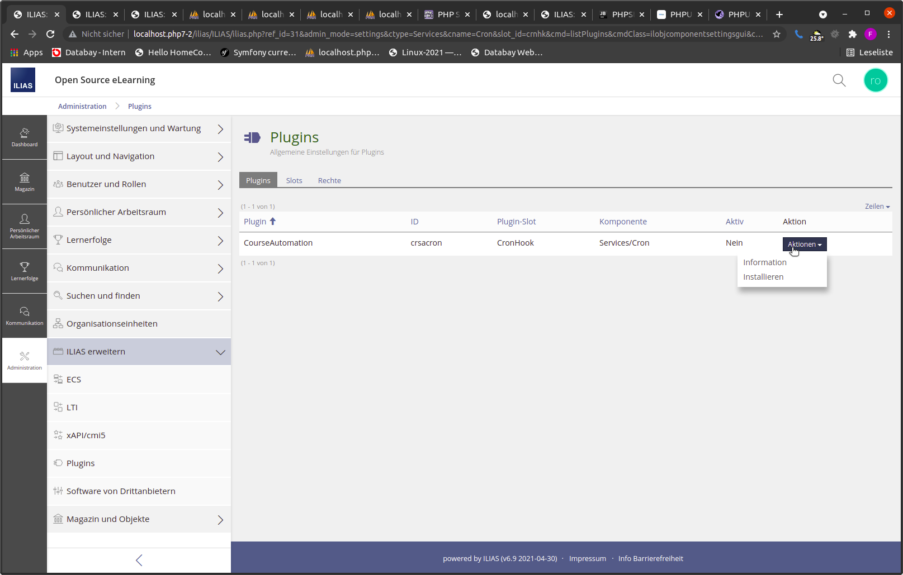
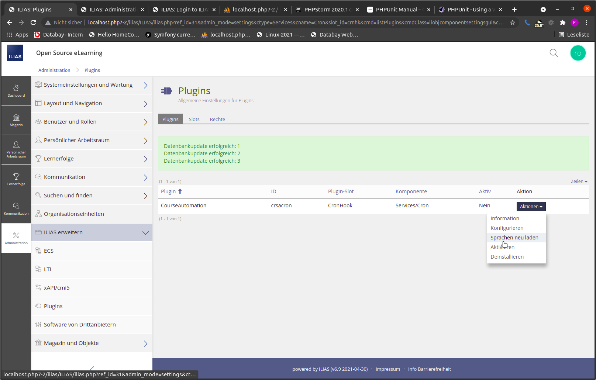
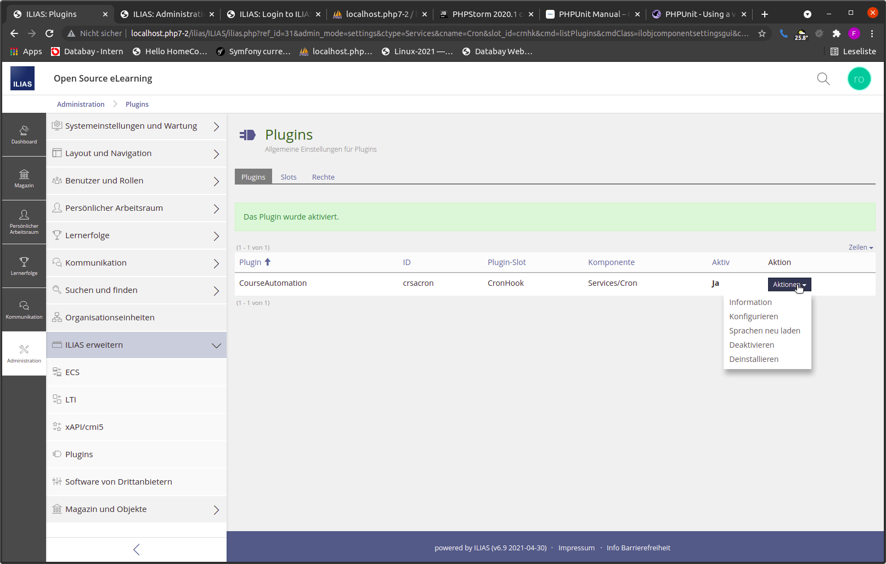
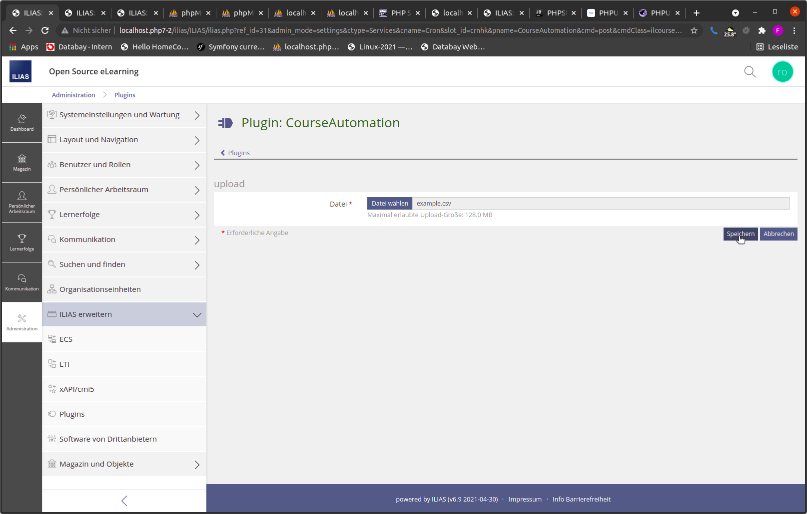
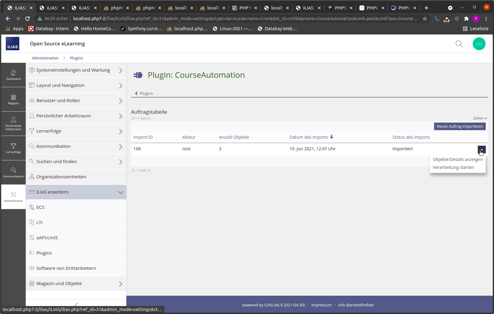
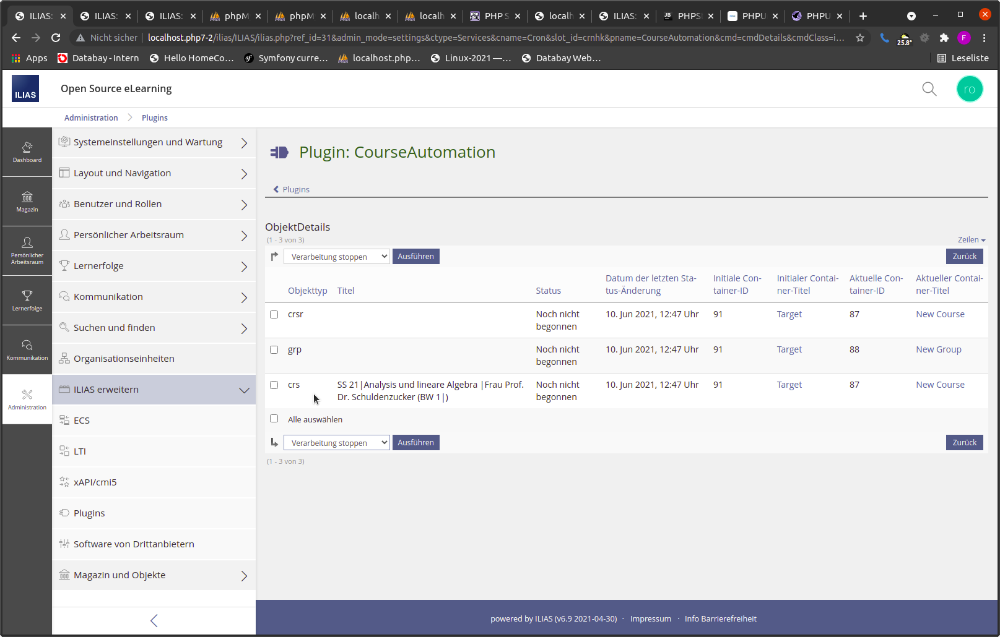
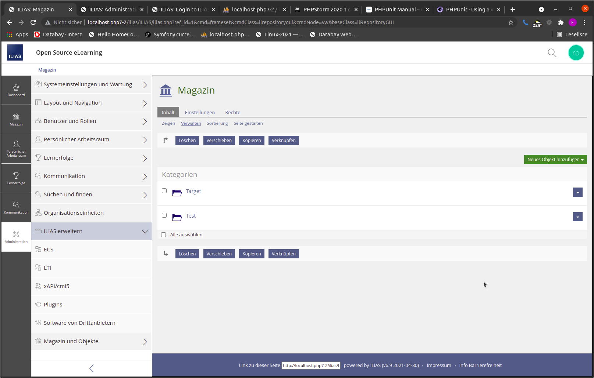
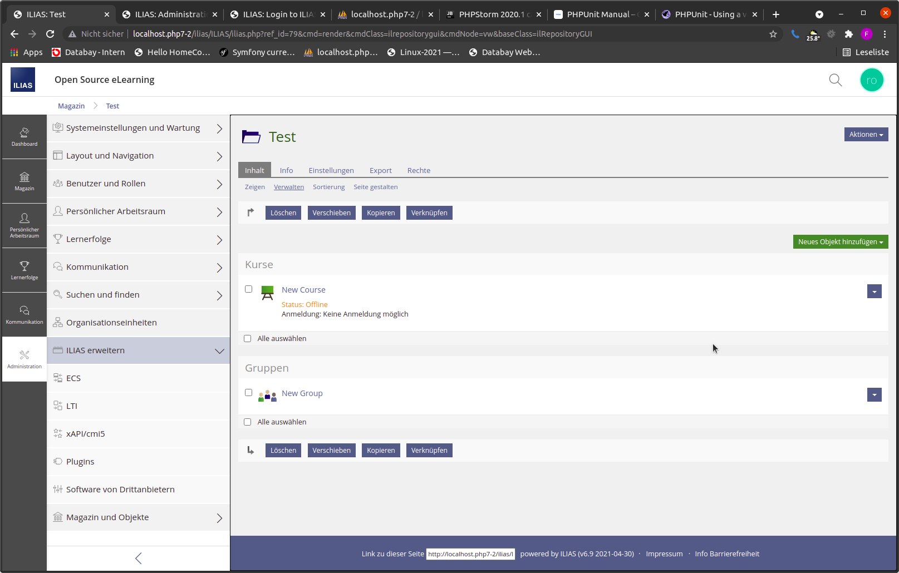
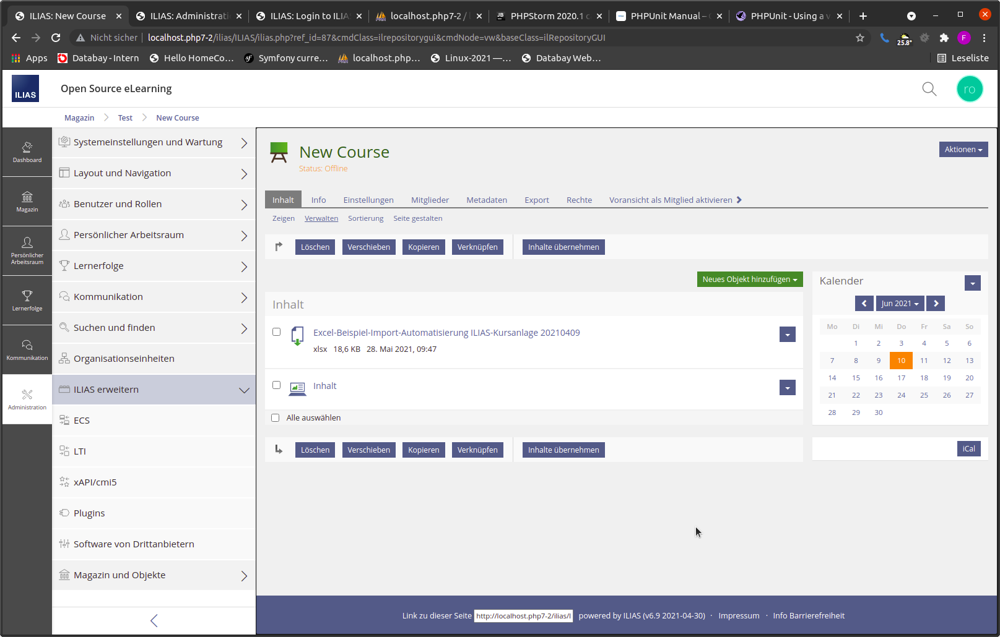
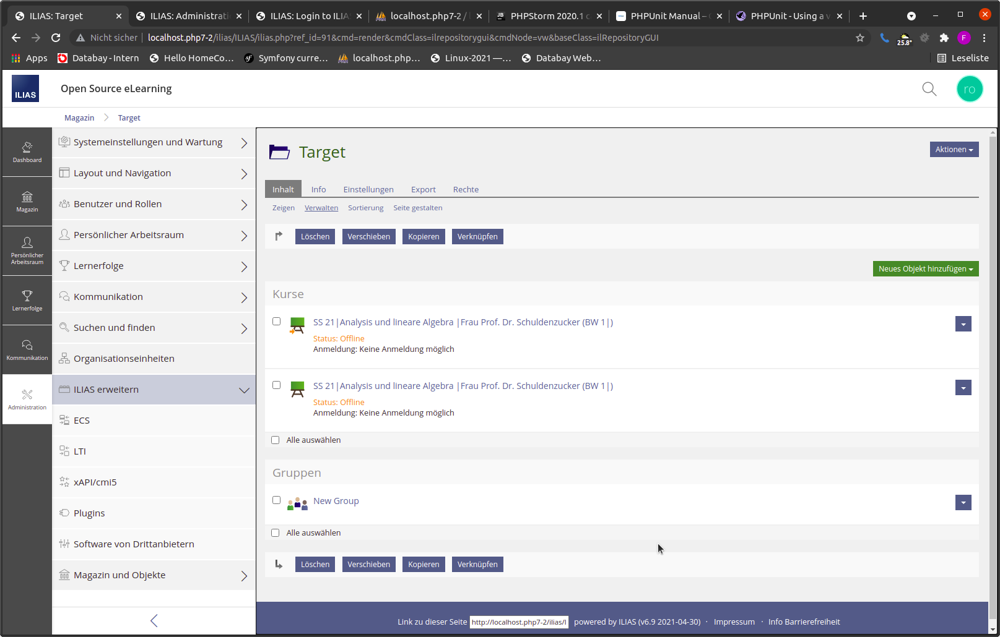

# Benutzerhandbuch CourseAutomation

## Table of Contents
* [Installation](#installation)
* [Benutzung](#benutzung)

### Installation
* Das Plugin ist zu finden Unter ILIAS->Administration->Plugins 

Das Plugin muss zunächst installiert werden

Nach erfolgreicher Installation sieht das Kontextmenü wie folgt aus:

Hier stehen als Nächstes die Optionen **Sprachen neu laden** und **Aktivieren** zur Verfügung um das Plugin weiter einzurichten

Nach der erfolgreichen Aktivierung kann das Plugin genutzt werden über die Option **Konfigurieren**

Die Auftragstabelle ist initial leer und beinhaltet alle importierten Aufträge

### Benutzung
* Um einen neuen import hinzuzufügen steht die Option "Neuen Auftrag importieren" zur Verfügung 

* Die im folgenden Schrit verwendete CSV Datei sieht wie folgt aus:  
  
| Target Ref-Id Repository Object (Category/Course/Group) | Container Type | Ref-Id Object-Template oder CRSR Link Target | Object-Title | CRSR Kurslink Import String |
|:---:|:---:|:---:|:---:|:---:|
91 | crs | 87 | SS 21 Analysis und lineare Algebra Frau Prof. Dr. Schuldenzucker (BW 1) | #4711|
91 | grp | 88
91 | crsr | #4711
* Quelle: [example.csv](./resources/example.csv)
CSV Dateien dieses Formates werden vom Pugin gefordert

* Nachdem die CSV Datei erfolgreich importiert wurde wird der Auftrag in der Tabelle angezeigt und kann über die Zeilenaktion **Objekte/Details anzeigen** im Detail betrachtet werden 

* Das Starten erfolgt entweder über die Zeilenaktion **Verarbeitung starten** der Auftragstabelle oder über die Tabellenaktion **Verarbeitung starten** der Tabelle ObjectDetails nach Selektieren gewünschter Kopieraufträge 
* Gestartete Aufträge können auch wieder gestoppt werden solange es noch einzelne Kopieraufträge gibt die nicht vom CronJob in Bearbeitung gesetzt wurden

## CronJob
* Im Beispiel sind die ids auf folgende MagazinObjekte bezogen
* Der Ordner Target bestizt ref_id=91, Test besitzt ref_id=79 (diese ist nicht relevant für die csv Datei)

* New Course besitzt ref_id=87, New Group besitzt ref_id=88
* Das sind die Template Objekte die in Target(ref_id=91) kopiert werden sollen
* Zusätzlich wird in der CSV Datei die Erstellung eines Kurslinks auf New Course(ref_id=87) in Target(ref_id=91) erstellt

* New Course besitzt zusätzlich Inhalt der beim Kopieren mit kopiert werden sollen   

* Nachdem der Beispiel Import Auftrag gestartet wurde, wird der CronJob bei der nächsten Ausführung die Kopiervorgänge ausführen
* Die Kopierten Objekte sind dann im Target Ordner wiederzufinden

  

